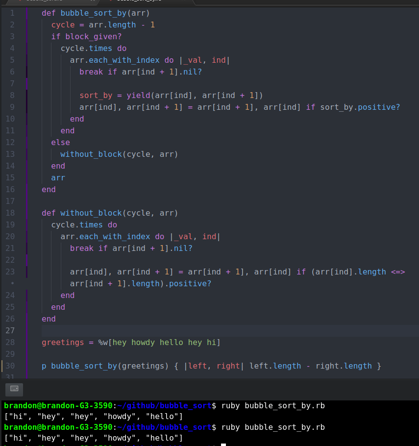

# bubble\_sort Ruby Project

This is Brandon and Kalu's Bubble Sort Ruby project

This is Brandon and Kalu's Bubble Sort Ruby project

This project was compiled by Kalu and Brandon in the Ruby section of the Microverse course work. It involved using ruby to create a sorting method.

  

### Built With

This project was compiled by Kalu and Brandon in the Ruby section of the Microverse course work. It involved using ruby to create a sorting method.

```text

```

## Built With

* [ ] Ruby
* [ ] Atom & VS Code
* [ ] Ubuntu
* [ ] Rubocop linter was used to check for style errors
* Ruby
* Atom & VS Code
* Ubuntu
* Rubocop linter was used to check for style errors

## Getting Started

## Getting Started

To get your own copy of our project simply clone the repository to your local machine.

To get your own copy of our project simply clone the repository to your local machine.

**Step 1**: Type the following command into a git shell

**Step 1**: Type the following command into a git shell

_git clone_ [_https://github.com/defoebrand/bubble\_sort.git_](https://github.com/defoebrand/bubble_sort.git)

_git clone_ [https://github.com/defoebrand/bubble\_sort.git](https://github.com/defoebrand/bubble_sort.git)

**Step 2**: Direct a terminal into the cloned repository directory

**Step 2**: Direct a terminal into the cloned repository directory

_cd bubble\_sort_

_cd bubble\_sort_

**Step 3**: Run the program from command line, open it in irb, or edit it in a text editor

**Step 3**: Run the program from command line, open it in irb, or edit it in a text editor

## Author

## Author

👤 **Brandon Defoe**

👤 **Brandon Defoe**

* Github: [@defoebrand](https://github.com/defoebrand)
* Gmail: [defoe.brand@gmail.com](mailto:defoe.brand@gmail.com)
* Github: [@defoebrand](https://github.com/defoebrand)
* Gmail: defoe.brand@gmail.com

👤 **Kalu Agu Kalu**

👤 **Kalu Agu Kalu**

* [Github](https://github.com/Godswilly)
* [Twitter](https://twitter.com/KaluAguKalu17)
* [Linkedin](https://www.linkedin.com/in/kalu-agu-kalu/)
* [Github](https://github.com/Godswilly)
* [Twitter](https://twitter.com/KaluAguKalu17)
* [Linkedin](https://www.linkedin.com/in/kalu-agu-kalu/)

## 🤝 Contributing

## 🤝 Contributing

Contributions, issues and feature requests are welcome!

Contributions, issues and feature requests are welcome!

Feel free to check the [issues page](https://github.com/defoebrand/bubble_sort/blob/master/issues).

Feel free to check the [issues page](https://github.com/defoebrand/bubble_sort/tree/c8ac52b91fce6a1a6dfe094da10204200d206736/issues/README.md).

## Show your support

## Show your support

Give a⭐️ if you like this project!

Give a ⭐️ if you like this project!

## 📝 License

## 📝 License

This project is licensed by Microverse and the Odin Project

This project is licensed by Microverse and the Odin Project

